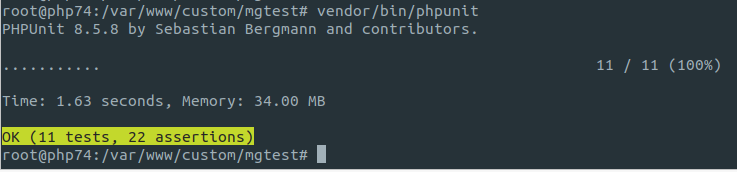
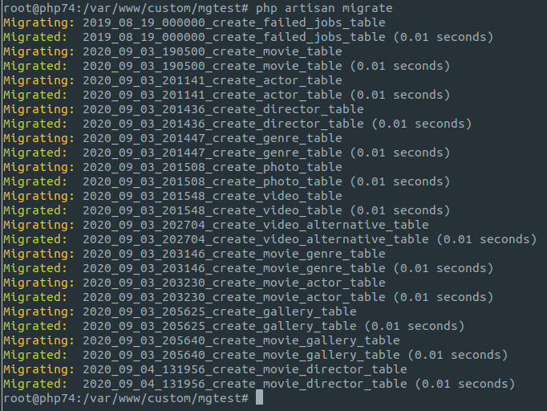
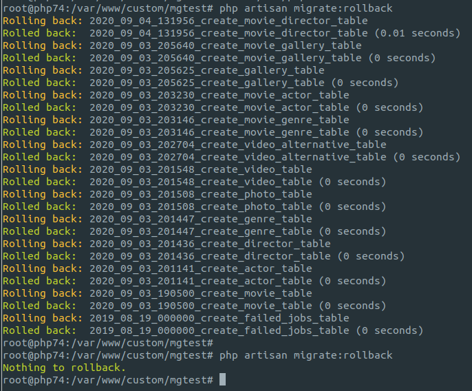
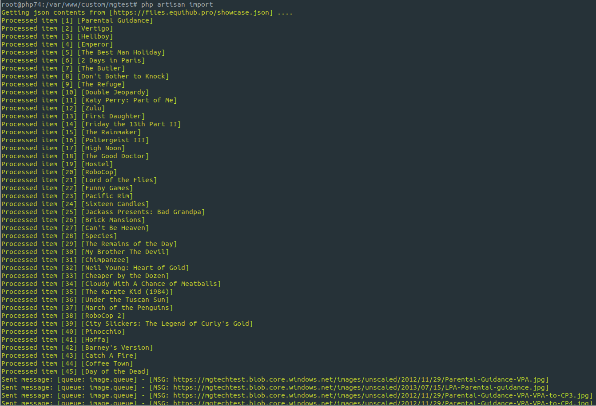
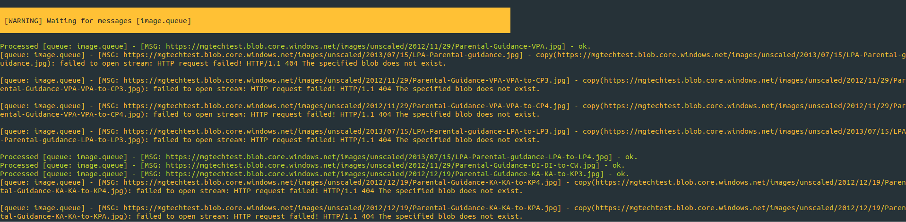
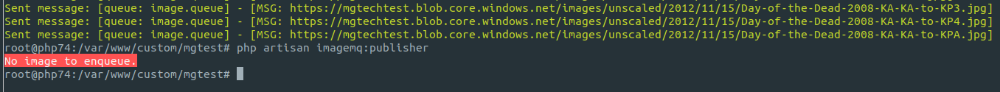
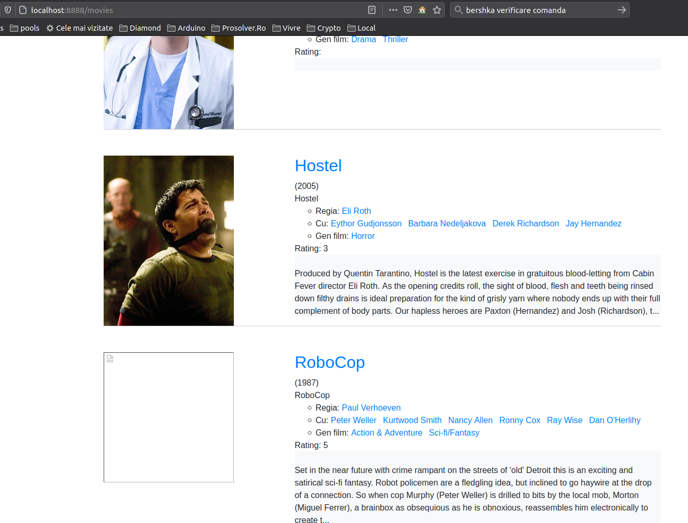

MindGeek Test
---

## Installation
- `git clone https://github.com/shmocs/mgtest`
- `cd mgtest`
- `./install.sh`
- `docker-compose exec php74 bash`

Inside container, run:
- `composer install`
- `mkdir -p storage/app/images` the location of cached images set in config/mindgeek.php 
- `php artisan storage:link` make cached images available to public location 
- `php artisan key:generate`
- `php artisan serve --host 0.0.0.0` will bind container 8000 port to host 8888 port (this terminal needs to stay open)

## Available access
http://localhost:8888 - `app site`

http://localhost:15672 (guest/guest) - `RabbitMQ Management to see the queues`

## Available commands
In a new terminal: `docker-compose exec php74 bash`

**Run tests**
 - `vendor/bin/phpunit`

**Apply migrations.**
 - `php artisan migrate`
  

**Can be run multiple times by rolling all over back and then migrate**
 - `php artisan migrate:rollback`  

**Start RabbitMq consumer, so it will be ready to parse/cache images inserted in database**
- `php artisan imagemq:consumer` - this terminal also must remain open so open another one for the rest of the operations 

**Proceed the import**
In a new terminal: `docker-compose exec php74 bash`
- `php artisan import`

- when items import id ready - it will launch the producer command (to put all unprocessed images in queue for caching)
- site should be ready/visible/populated now - even if not all images are yet cached  

**In the meantime consumer started to process messages**

- unavailable images & available images - are all marked as processed, so they won't be processed again at subsequent commands 
- site is serving only cached images 

**Producer can be executed again - it will deal only with unprocessed images**

- if import is launched again - it will reset processed flag and producer will enqueue again images to be processed

**Outcome ...**

- in the meantime consumer keeps caching the available images 

.
